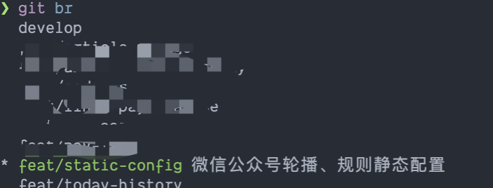

## 遇到过的Git错误
> Q: refusing to merge unrelated histories <br />
> A:   
> 情况1: 克隆了一个项目但丢失了.git目录，导致git不能获取本地历史记录  
> 情况2: 创建了一个新的存储库，向它添加了一些提交，现在您正试图从已经拥有自己一些提交的远程存储库中提取  
> 解决：git pull origin \<branch\> --allow-unrelated-histories

## git小技巧
### 为分支添加注释
1.为分支添加描述
```bash
git config branch.{branch_name}.description {描述内容}
```
2. 下一个工具包
```
npm i -g git-br
```
3. 查看分支
```
git br 查看
```
4. 结果展示


[返回目录](./)